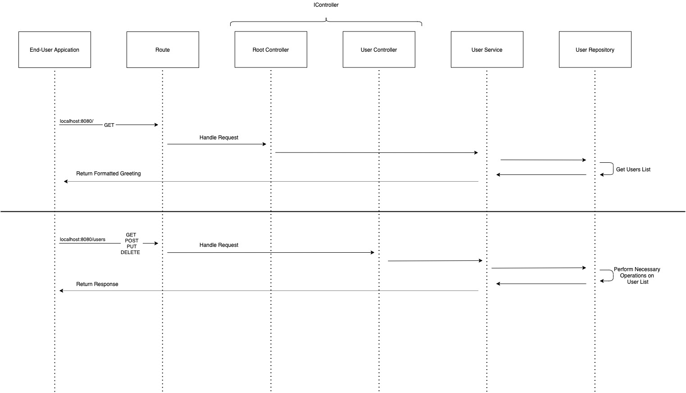
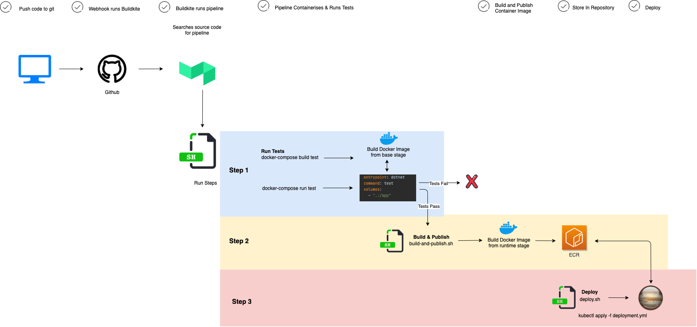

[](https://buildkite.com/myob/martyna-frameworkless-web-app)

# Frameworkless Basic Web Application Kata
### This application has been created for the second Quorum Review, as part of MYOB's Future Makers Academy acceleration program.

# Requirements
It's the late 1990s and the internet has just begun to flourish. You have a brilliant idea to build a Hello World web application however there are no MVC frameworks for you to use. Your mission is to implement a basic Hello World web application without using any frameworks. 

When calling the web application from a browser it should return a greeting with your name and the current date/time of the server. For instance, if your name was Bob when hitting the web server (http://localhost:8080) the browser would display "Hello Bob - the time on the server is 10:48pm on 14 March 2018" 

_(Yes, we know we said you were in the 1990s... but we want you to use your current servers date/time ;-))_

Oh, and of course you are one of those new age eXtreme programmers so you need to have appropriate tests! To make your life easier we have got starting points for Java and C#  

## To summarise 

* Keep with standard libraries, don't use frameworks like Spring/Dropwizard or equivalent  
* Try implement all the dispatching code manually.  
* Include in your solution a test case for proving that the "greeting" portion of the system is functioning correctly.  

If you are working in C#, a trivial web server that doesn't rely on
ASP.NET Core follows. Note that it handles a single request at a time,
synchronously. Converting it to be asynchronous, so as to be able to handle
more than one request simultaneously, is a useful future exercise.

~~~
var server = new HttpListener();
server.Prefixes.Add("http://localhost:8080/");
server.Start();
while (true)
{
    var context = server.GetContext();  // Gets the request
    Console.WriteLine($"{context.Request.HttpMethod} {context.Request.Url}");
    var buffer = System.Text.Encoding.UTF8.GetBytes("Hello");
    context.Response.ContentLength64 = buffer.Length;
    context.Response.OutputStream.Write(buffer, 0, buffer.Length);  // forces send of response
}
server.Stop();  // never reached...
~~~

----------------------------------------------------------------------

# Enhancements

Their requirements are as follows:

* By default your web application should just great you with your name and the date however (assume for these examples your name is Bob)
* You should be able to add additional people to the list. For example, say you want to add Mary to your hello world, after calling the appropriate http requests it should display "Hello Bob and Mary - the time on the server is 10:59pm on 14 March 2018" _(Yes, we know that's no the late 1990's!)
* You should then be able to add Sue to your hello world, "Hello Bob, Mary and Sue - the time on the server is 10:59pm on 14 March 2018"
* You can also remove people from the greeting, you could remove Mary while keeping Sue , "Hello Bob & Sue - the time on the server is 11:01pm on 14 March 2018"
* You should be able to have a custom url to get just a list of people's names without the greetings
* You should be able to change someones name, if you have already added Sue and Sue now want's to be called Dave, you should be able to do that.
* You can never remove yourself from the world - in this world Bob will always be there, in your world you should always be there!
* You can also assume that everyone in your hello world has a unique name, there is only ever one Bob, one Dave, one Mary, etc.
* You can have a UI to show the state of the resource, but you don’t need to worry about UI forms for adding/updating/removing people, just interact using curl or postman or your http tool of choice to send http requests to modify the state of the resource.

* Oh, and of course you are still a big believer of automated tests (this is sounding less and less like the 90's) so you need to have appropriate tests for all important logic!
<br/>
---
## Installation

### System Requirements
- A command line interface (CLI) such as Command Prompt for Windows or Terminal for macOS
- [.Net Core 3.1 SDK](https://dotnet.microsoft.com/download) or later. If you have homebrew you can install the latest version of the .NET Core SDK by running the command `brew cask install dotnet-sdk` in the CLI
- [AWS CLI version 2](https://docs.aws.amazon.com/cli/latest/userguide/install-cliv2.html)
### Clone

- Clone this repo to your local machine and in the CLI, navigate into the folder containing the solution and type `dotnet restore` to install the package dependencies

```shell
$ git clone git@github.com:myob-fma/martyna-frameworkless-web-app.git
$ cd <your chosen folder>
$ dotnet restore
```

### Running the application
- Navigate to the solution folder, cd into the root directory of the project and run the project using the below command:

```
$ dotnet run
```
---

### Running the tests
Staying in the solution folder, enter `dotnet test` in your CLI to run the unit tests in the solution

---
## The design
This application is a basic web API which returns a formatted message and collects user names in a local list.  It has two endpoints, one being the root, and the other being users.

The application itself is loosely based on domain-driven design as well as the Create, Read, Update and Delete (CRUD) Paradigm, which evolved as I was learning my way around http and APIs.

## How it works
An HTTP request is made and a custom request object is instantiated. Based on the URI endpoint, the Router class routes the request and instantiates a new instance of the required controller - because both controllers are implementing IController Interface, the appropriate methods are then called on the required controller instance and based on the request type.


## Usage
### Accessing the deployed application
https://martyna-web-app.svc.platform.myobdev.com/

### GET Requests
Using Postman or curl, making a GET request to the [root](https://martyna-web-app.svc.platform.myobdev.com/) path will return a greeting containing the name of the application owner and other names in the repository, along with the date and time on the server as below:
```
Hello Martyna and Bob - the time on the server is 3:45 AM on 13 January 2121
```

A GET request to the [/users](https://martyna-web-app.svc.platform.myobdev.com/users) endpoint will return the names held in the repository
```
Martyna, Bob
```
### POST Requests
https://martyna-web-app.svc.platform.myobdev.com/users <br/>
All POST requests to the [/users](https://martyna-web-app.svc.platform.myobdev.com/users) path will only be handled using x-www-form-urlencoded
The `Name` key-pair is required to add a new name to the repository.
A successful POST request will return a message that name has been added.
```
Bob has been added
```
### DELETE Requests
https://martyna-web-app.svc.platform.myobdev.com/users/bob <br/>
All DELETE requests to the [/users/<user name>](https://martyna-web-app.svc.platform.myobdev.com/users) path will only be handled using x-www-form-urlencoded
A successful DELETE request will return a message that name has been added.
```
Bob has been removed from the list
```
### PUT Requests
https://martyna-web-app.svc.platform.myobdev.com/users/bob <br/>
All PUT requests to the [/users/<user name>](https://martyna-web-app.svc.platform.myobdev.com/users) path will only be handled using x-www-form-urlencoded
The `Name` key-pair is required to update a name in the repository.
A successful PUT request will return a message that name has been updated.
```
Bob has been updated to Terry
```

### Error Codes
If attempting to add a name that is already in the user list, a 403 (Forbidden) status code will be returned with the custom message below:
```
sorry that can't be done
```
If there is no body in the request, a 400  (Bad Request) status code will be returned with the custom message below:
```
no body found
```

---

## Deployment and Infrastructure
This application has been deployed on a framework built on top of Kubernetes and is running on an automated CI/CD pipeline.  The below diagram illustrates the workflow from commit, to deployment.


### Pipeline
#### Step 1
This step of the pipeline builds the test image and runs the tests against the source code. if the tests fail, the pipeline stops running.

#### Step 2
The Build and publish script builds the docker image before calling a sh file which runs a series of curl request tests against the running container, which, when successful, pushes the image to the Elastic Repository Registry, or ECR on AWS. It does this by logging into the ECR, thanks to the IAM permissions set on the repository.

#### Step 3
Step 3 deploys the application via the deploy script, passing the image tag (the truncated Buildkite commit number) into the deployment yaml, which ensures that new pods are spun up at each successful commit.  The deployment.yml declares all requirements for the application to run, incl

- number of replicas (pods)
- compute requirements

## Dependencies
[XUnit](https://xunit.net/) - Testing framework <br/>
[Docker](https://www.docker.com/) - Containerisation <br/>
[AWS CLI version 2](https://docs.aws.amazon.com/cli/latest/userguide/install-cliv2.html)

 